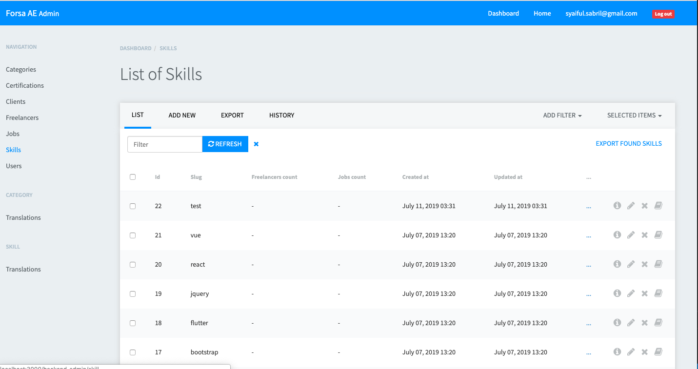

RailsAdminSabrilTheme
===================================================

It is a clean theme which can be used with [Rails Admin](https://github.com/sferik/rails_admin).



Use a theme
---------------------------------------------------

In your Gemfile:

```
gem 'rails_admin_sabril_theme', :git => 'git@github.com:sabril/rails_admin_sabril_theme.git'
```

Inside config/application.rb, just after Bundler.require:

```
ENV['RAILS_ADMIN_THEME'] = 'sabril_theme'
```